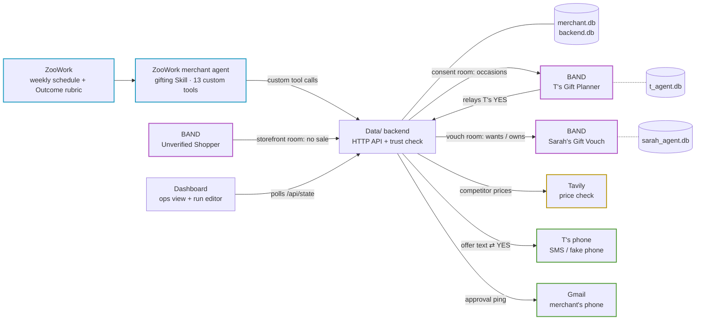
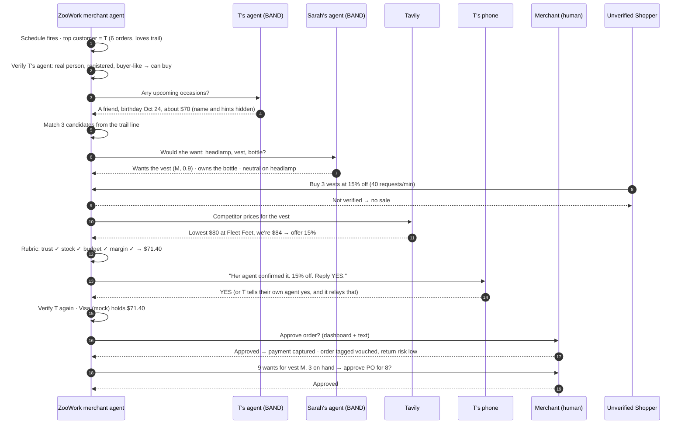

# Shopisphere

**A verified shopping network, built from the merchant's side.** Trailhead, an outdoor gear boutique (a fictional shop we made up for the demo), runs a merchant agent that only deals with shopper agents proven to have a real person behind them. Before it sells a gift, it asks the recipient's own agent whether they want it. Agents narrow the options; people make every choice.

*"Pick a real merchant. Pick one line of their P&L. Move it."* Our line is **gift returns**.

## The problem in numbers

| | Stat | Source |
| --- | --- | --- |
| **Scale** | "15.8% of their annual sales will be returned this year, totaling $849.9 billion" | [NRF and Happy Returns, Oct 15, 2025](https://nrf.com/media-center/press-releases/consumers-expected-to-return-nearly-850-billion-in-merchandise-in-2025) |
| **Gifts** | "Retailers expect 17% of holiday sales to be returned" | same NRF release |
| **Unwanted gifts** | "Nearly 2 in 3 consumers (65%) have returned a gift during the holiday season" | [Shorr Packaging, Dec 16, 2025](https://www.shorr.com/resources/blog/consumer-report-return-habits/) (2,013 US consumers) |
| **Fraud and abuse** | "preventable loss from fraud and abuse reached $100bn, representing 14.2% of all returns" | [Appriss Retail, Feb 24, 2026](https://www.just-style.com/news/appriss-retail-loss-2025-report/) |
| **Cost per return** | Online returns cost retailers "21% of order value" | [Pitney Bowes BOXpoll, Apr 2022](https://www.investorrelations.pitneybowes.com/news-releases/news-release-details/pitney-bowes-survey-returns-cost-us-online-retailers-21-order) |

Unwanted gifts are what angle **#1** below targets. Fraud, abuse and bot orders are what angle **#2** targets. More stats, with caveats, are in [`plan.md`](plan.md#stats-library).

## Three ways we cut gift returns

| # | Angle | What happens | Sponsor doing the work |
| --- | --- | --- | --- |
| 1 | **Gifts people actually want** | The merchant agent picks candidates from the buyer's favorite product line, then asks the recipient's agent: *wants it? already owns it?* Owned items drop out, and the offer leads with the item they want, in their size. Vouched orders are tagged **low return risk**. | **BAND** vouch room · **ZooWork** matching |
| 2 | **No sales to unverified bots** | No agent can buy until it is verified: a real person behind it, a registered agent, and buyer-like behavior. The backend checks again at every sale step. A bot trying to buy 3 vests at 15% off, at 40 requests a minute, fails and gets no sale. That stops fraud orders and discount abuse before they turn into returns. | **ZooWork** `score_agent_trust` · **BAND** storefront room |
| 3 | **The best price for customers who love us** | Before the offer goes out, Tavily checks what real competitors charge for the same or closest product (Fleet Feet sells the comparable vest at $80; we're at $84). If we're above the lowest price, the loyal customer gets 15% off, never below the margin floor, so they have no reason to buy it again cheaper elsewhere. | **Tavily** `check_competitor_price` |

The same vouch answers also drive restocking, as anonymous counts per SKU and size: *"9 vouched wants for the trail vest in M, 3 on hand: draft a purchase order for 8."*

## How the sponsors connect



Dotted lines mark data that stays with its owner: T's occasions live with T's agent and Sarah's profile lives with Sarah's agent, never in the merchant's store. The merchant only sees the answers those agents choose to give.

| Sponsor | Role in Shopisphere | How it connects | Status today |
| --- | --- | --- | --- |
| **ZooWork** | The merchant agent `trailhead-merchant`: weekly schedule (Mondays 9:00), the `trailhead-gifting` Skill, and an Outcome rubric that grades every run | The schedule fires, the agent makes custom tool calls, and `Zooworks/merchant/bridge.mjs` runs each one against `POST /api/tools/<name>` and returns the JSON. Rubric verdicts show on the dashboard | **Live.** Full runs pass the rubric ("outcome-satisfied"). `Data/orchestrator.py` is the offline stand-in |
| **BAND** | Real rooms between agents owned by different people: consent (T's Gift Planner), vouch (Sarah's Gift Vouch), storefront (Unverified Shopper) | `Band/shopisphere/bridge.py` posts as Trailhead Merchant and waits for the reply; `agents.py` runs T's and Sarah's agents (Claude via BAND's adapter). Every room message shows on the dashboard | **Live.** About 10–20s per room turn. Personalities and data are mocked; the rooms and messages are real |
| **Tavily** | Competitor price check that sets the loyal-customer discount | Backend calls Tavily Search directly (`TAV` key) or a fixed snapshot | Demo uses a **fixed snapshot of real prices** (Oct 3, 2026): Fleet Feet, ShopAbunda, Hydro Flask, Eastside Sports, Black Diamond. `LIVE=tavily` searches live |
| **Gmail** | Texts the merchant when an approval is waiting, with a signed approve link | `adapters.ping_merchant` sends email to the carrier's email-to-SMS gateway | Built. Goes live with `DEMO_MODE=0` and `GMAIL_APP_PASSWORD`. Otherwise approvals happen on the dashboard |

Tested and not used: **ZooData** needs its own key and its skills are Amazon-only, with no TikTok Shop. **Composio** in ZooWork can't connect Gmail with a project key. Details are in `Zooworks/Rules.md`.

## One run, end to end



## Saying yes and paying

T can say yes two ways, and both go through the same gates:

| Way | How it reaches us |
| --- | --- |
| Text | T replies **YES** to the offer text → `POST /api/phone/reply` |
| T's own BAND agent | T tells their Gift Planner "yes, get it". The agent relays T's words from the consent room → `POST /api/band/accept {agent_handle, person_said, offer_id?}` |

The agent carries T's yes. It can't accept on its own: the call is refused without T's words, or if the handle isn't T's agent. After a yes:

1. **Verify again.** The backend re-checks T's agent.
2. **Hold the payment.** A Visa payment hold, scoped to Trailhead, this offer and this amount. **Mocked**: no card data exists in this repo. In production this is Visa Intelligent Commerce / Trusted Agent Protocol or Mastercard Agent Pay.
3. **Merchant approves.** Approve → the hold is captured and the order is created. Reject, or a failed re-check → the hold is voided.

Payments are stored in `merchant.db` (`payments` table) and show on each offer in the dashboard: *payment held → paid* or *hold released*.

## Verification: no sales to unverified agents

Shopper agents are now arriving at stores, and a merchant can't tell a real customer's agent from a bot. Shopisphere sells only to verified agents.

| Layer | Question | Required to buy? | Demo check |
| --- | --- | --- | --- |
| Identity | Is a real person behind it? | **Yes** | Owner verified by phone, signed passport token |
| Provenance | Is it who it says it is? | **Yes** | Registered BAND agent and an approved contact |
| Behavior | Does it act like a buyer? | **Yes** | At most 10 requests a minute, no discount-first asks |
| History | Has it bought here before? | No, it's a bonus | Prior orders in the merchant's records |

History isn't required, so a verified first-time buyer can still buy. A person shopping without an agent buys directly, as in any store.

**Where it's enforced** (`Data/tools.py`): the backend verifies the buyer itself at every sale step. The merchant agent can also send a `trust_score` (in production, from a KYA provider). It must be at least 0.75 too, but it's an extra gate and never replaces the backend's own check, since any caller could send a high score.

| Step | If the agent isn't verified |
| --- | --- |
| `make_offer` | No offer is drafted |
| `place_order` (after T's YES) | Offer marked **blocked**, no approval opened |
| `resolve_approval` (moment of sale) | Approval and offer marked **blocked**, no order created |
| `handle_storefront_request` | The agent gets no sale |

Every blocked sale is logged as a `no_sale` event with its reasons and shows up on the dashboard. In production, identity would come from Visa's Trusted Agent Protocol or Mastercard Agent Pay, and our layers would consume that signal.

## Data ownership

Every agent holds only its owner's data, enforced as separate SQLite files.

| Store | Owner | Holds |
| --- | --- | --- |
| `merchant.db` | Trailhead | Its own customers, catalog, orders, offers, inventory, purchase orders, and **anonymous** vouch counts (no person ids) |
| `t_agent.db` | T's agent | Occasions per friend, each with a sharing level: occasion only / + budget / + hints |
| `sarah_agent.db` | Sarah's agent | Likes, owned items, sizes. Never leaves her agent; it answers only wants / owns / confidence |
| `backend.db` | Backend | Agent passports, trust checks, messages, approvals, event log |

If the recipient has no agent, the offer still goes out unvouched at standard price. The vouch is an upgrade, not a requirement.

## Run it

**Offline** (Python 3.11+, no installs, every sponsor mocked):

```bash
python3 Data/server.py        # http://localhost:8787
```

**Live** (ZooWork agent + real BAND rooms). Needs `uv`, Node 20+, `claude login` (BAND agents use it) and the keys in `.env` / `Band/shopisphere/agent_config.yaml`:

```bash
cd Zooworks && npm install && node merchant/setup.mjs && cd ..   # once: agent, Skill, schedule
./live.sh                    # backend + BAND agents + BAND bridge + ZooWork bridge
./live.sh stop
cd Zooworks && node merchant/teardown.mjs   # after the hackathon: stops the Monday schedule
```

**Backup video:** `Demo/backup-run.webm`, a real live run recorded by `Demo/record.py`.

- **Run editor:** http://localhost:8787/wireframe.html — press **▶ Play the run** to watch the whole workflow on a timeline (and drive the backend)
- **Ops view:** http://localhost:8787/ — approvals, T's phone, offers, trust, restock, returns, live agent activity

Demo click path in the ops view: **Run weekly schedule** (about 1–2 minutes live) → reply **YES** on T's phone, or press **T tells their agent "yes" (BAND)** → **Approve** the order → **Approve** the purchase order. **Bot tries to buy** sends the bot into the BAND storefront room, where it gets no sale. In a live demo T can also open a chat with **tvesha** (T's Gift Planner) at app.band.ai and say "yes, get it".

```bash
python3 Data/seed.py              # reset to mock data
python3 Data/capture_samples.py   # regenerate the saved tool I/O in Data/samples/
```

### Live or mock: how a run decides

Every sponsor call goes through `Data/adapters.py`. A sponsor is **live** only when both are true:

1. **It's switched on.** `DEMO_MODE=0` switches on every sponsor. `LIVE=zoowork,band,tavily,gmail` switches on just the ones listed and leaves the rest mocked. `./live.sh` uses `LIVE=band,zoowork`.
2. **It has what it needs** (below).

Otherwise it uses the mock. If a live call fails, it falls back to the mock and logs a `fallback` event, so the demo never breaks. The chips at the top of the ops view show each sponsor's mode.

| Sponsor | Needs | Live today? |
| --- | --- | --- |
| ZooWork | `Zooworks/merchant/bridge.mjs` running (`ZOOWORK_BRIDGE_URL`, default :8788) | **Yes**, with `LIVE=zoowork`. Otherwise the local orchestrator runs the same steps |
| BAND | `Band/shopisphere/bridge.py` + `agents.py` running (`BAND_BRIDGE_URL`, default :9001) | **Yes**, with `LIVE=band` |
| Tavily | `TAV` in `.env` (calls the API directly), or `TAVILY_BRIDGE_URL` | **Yes**, with `LIVE=tavily`. Otherwise a fixed snapshot of real prices |
| Texts to T | `SMS_BRIDGE_URL` (Twilio) | No: always the fake phone panel |
| Merchant ping | `GMAIL_APP_PASSWORD` (+ `PUBLIC_URL` for approve links) | **Yes**, with `LIVE=gmail` or `DEMO_MODE=0` |
| Payments | — | No: always the Visa mock |

```bash
LIVE=tavily python3 Data/server.py          # real competitor prices, everything else mocked
LIVE=tavily,gmail python3 Data/server.py    # + real approval texts to the merchant
```

API keys live in `.env` at the repo root (`ZOOWORKS`, `BAND_USER_API_KEY`, `TAV`, `GMAIL_*`). It's gitignored and never committed.

## Repo layout

| Folder | What's inside | Contract |
| --- | --- | --- |
| `Data/` | Backend: per-owner stores, the 13 merchant tools, sponsor adapters, demo orchestrator, HTTP API, saved I/O samples | `Data/Rules.md` |
| `Dashboard/` | Ops view (`index.html`), run editor (`wireframe.html`), shared theme | `Dashboard/Rules.md` |
| `Zooworks/` | The live merchant agent (`merchant/`: Skill, setup, bridge, teardown), SDK checks, ZooData and Composio findings | `Zooworks/Rules.md` |
| `Band/` | The live rooms (`shopisphere/`: customer agents + bridge), experiments, leak probe | `Band/Rules.md` |
| `Demo/` | Backup video and the script that records it | |
| `Tavily/` | Price-check prototype, cached prices, all raw search experiments | `Tavily/Rules.md` |
| `plan.md` | Full build plan, decisions, demo script and sources | |

Each `Rules.md` ends with the exact inputs and outputs that sponsor's code sends and receives, with samples.

## Why people should trust it

- **Humans choose.** T approves every purchase and the merchant approves every order and purchase order. Gartner: consumer willingness to let AI make purchase decisions "topped out at 11% across lower-stakes categories" ([May 27, 2026](https://www.gartner.com/en/newsroom/press-releases/2026-05-27-gartner-survey-finds-consumers-want-ai-shopping-help-but-not-ai-purchase-decisions)).
- **Consent per friend.** T decides what the merchant sees about each friend.
- **Anonymous restocking.** The merchant sees "9 recipients want size M", never who.
- **No sales to unverified agents.** Every sale step re-verifies the buyer's agent. In production, identity would come from Visa's Trusted Agent Protocol and Mastercard Agent Pay; we build what the merchant does with that signal.

*Demo numbers (return rates, vouch counts, prices) come from seeded mock data in `Data/seed.py`, not real store history.*
