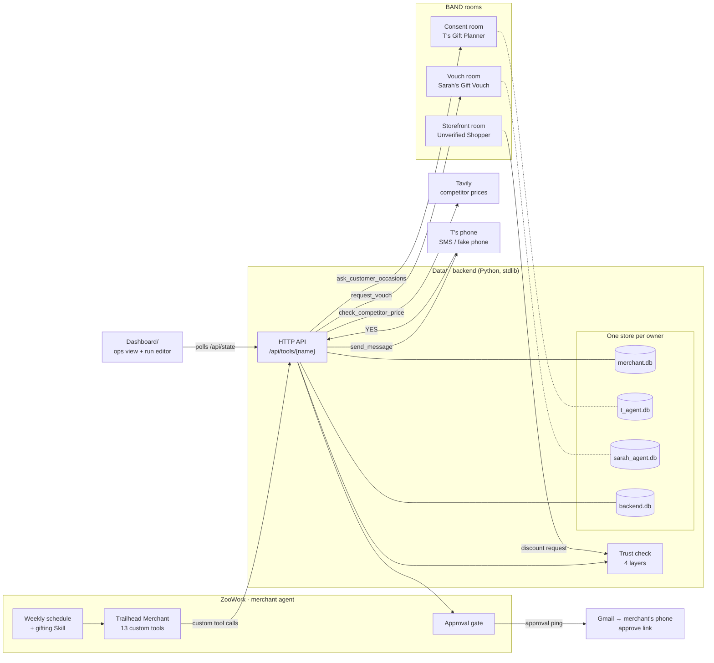

# Shopisphere

**A verified shopping network, built from the merchant's side.** Trailhead, an outdoor gear boutique, runs a merchant agent that only deals with shopper agents proven to have a real person behind them. Before it sells a gift, it asks the recipient's own agent whether they want it. Agents narrow the options; people make every choice.

Built for the ZooWork hackathon brief: *"Pick a real merchant. Pick one line of their P&L. Move it."* Our line is **gift returns**.

> "Nearly a quarter of all returns occur around Christmastime." [Optoro](https://www.optoro.com/returns-news/your-holiday-gift-returns-cost-retailers-billions/)

## Three ways we cut gift returns

| # | Angle | What happens | Sponsor doing the work |
| --- | --- | --- | --- |
| 1 | **Gifts people actually want** | The merchant agent picks candidates from the buyer's favorite product line, then asks the recipient's agent: *wants it? already owns it?* Owned items drop out, and the offer leads with the item they want, in their size. Vouched orders are tagged **low return risk**. | **BAND** vouch room · **ZooWork** matching |
| 2 | **No discounts or orders for unverified bots** | Every agent that talks to the store passes a four-layer trust check: identity, provenance, history and behavior. A bot asking for 15% off at 40 requests a minute fails all four and is declined. That stops discount abuse and fraud orders that come back as returns. | **ZooWork** `score_agent_trust` · **BAND** storefront room |
| 3 | **The best price for customers who love us** | Before the offer goes out, Tavily checks what competitors charge for the same product. If we're above the lowest price, the loyal customer gets 15% off, never below the margin floor, so they have no reason to buy it again cheaper elsewhere. | **Tavily** `check_competitor_price` |

The same vouch answers also drive restocking, as anonymous counts per SKU and size: *"9 vouched wants for the trail vest in M, 3 on hand: draft a purchase order for 8."*

## How the sponsors connect



Dotted lines are data that never crosses over: T's occasions stay with T's agent and Sarah's profile stays with Sarah's agent. The merchant only sees the answers they choose to give.

| Sponsor | Role in Shopisphere | How it connects | Status today |
| --- | --- | --- | --- |
| **ZooWork** | The merchant agent: weekly schedule, gifting Skill, Outcome rubric on offers, approval gate before any order | Agent emits `agent.custom_tool_use` → our bridge POSTs the input to `POST /api/tools/<name>` → returns the JSON as the tool result. Tool declarations: `GET /api/tools` | Key and agent start/stop verified live (`Zooworks/live-check.mjs`). `Data/orchestrator.py` runs the same tool sequence as a stand-in while the bridge is wired |
| **BAND** | Rooms between agents owned by different people: consent (T), vouch (Sarah), storefront (bot) | Backend calls a BAND bridge: `POST /share_occasions`, `POST /vouch_for`. Room messages post to `/api/events` for the dashboard | REST bridge and vouch agent tested live. The vouch agent refused a leak probe for Sarah's address and sizes (`Band/Rules.md`). Backend uses `Data/mock_agents.py` until `BAND_BRIDGE_URL` is set |
| **Tavily** | Competitor price check that sets the loyal-customer discount | Backend calls `POST /competitor_prices {sku, query, our_price}` | Live prototype `Tavily/check_competitor_price.py`, ~3s per search, with a cached fallback for the demo products |
| **Gmail** | Texts the merchant when an approval is waiting, with a signed approve link | `adapters.ping_merchant` sends email to the carrier's email-to-SMS gateway | Built. Goes live with `DEMO_MODE=0` and `GMAIL_APP_PASSWORD`. Otherwise approvals happen on the dashboard |

Tested and not used: **ZooData** needs its own key and its skills are Amazon-only, with no TikTok Shop. **Composio** in ZooWork can't connect Gmail with a project key. Details are in `Zooworks/Rules.md`.

## One run, end to end

```mermaid
sequenceDiagram
  autonumber
  participant Z as ZooWork merchant agent
  participant T as T's agent (BAND)
  participant S as Sarah's agent (BAND)
  participant V as Tavily
  participant P as T's phone
  participant H as Merchant (human)
  participant Bot as Unverified Shopper

  Z->>Z: Schedule fires · top customer = T (6 orders, loves trail)
  Z->>Z: Trust check on T's agent: 4/4 pass
  Z->>T: Any upcoming occasions?
  T-->>Z: A friend, birthday Oct 24, about $60 (name and hints hidden)
  Z->>Z: Match 3 candidates from the trail line
  Z->>S: Would she want: headlamp, vest, bottle?
  S-->>Z: Wants the vest (M, 0.9) · owns the bottle · neutral on headlamp
  Bot->>Z: 15% off please (40 asks/min)
  Z-->>Bot: Declined: identity, provenance, history and behavior all fail
  Z->>V: Competitor prices for the vest
  V-->>Z: Lowest $64; we're $68 → offer 15%
  Z->>Z: Rubric: trust ✓ stock ✓ budget ✓ margin ✓ → $57.80
  Z->>P: "Her agent confirmed it. 15% off. Reply YES."
  P-->>Z: YES
  Z->>H: Approve order? (dashboard + text)
  H-->>Z: Approved → order tagged vouched, return risk low
  Z->>H: 9 wants for vest M, 3 on hand → approve PO for 8?
  H-->>Z: Approved
```

## Data ownership

Every agent holds only its owner's data, enforced as separate SQLite files.

| Store | Owner | Holds |
| --- | --- | --- |
| `merchant.db` | Trailhead | Its own customers, catalog, orders, offers, inventory, purchase orders, and **anonymous** vouch counts (no person ids) |
| `t_agent.db` | T's agent | Occasions per friend, each with a sharing level: occasion only / + budget / + hints |
| `sarah_agent.db` | Sarah's agent | Likes, owned items, sizes. Never leaves her agent; it answers only wants / owns / confidence |
| `backend.db` | Backend | Agent passports, trust checks, messages, approvals, event log |

If the recipient has no agent, the offer still goes out unvouched at standard price. The vouch is an upgrade, not a requirement.

## Run it

Python 3.11+, no installs.

```bash
python3 Data/server.py        # http://localhost:8787
```

- **Run editor:** http://localhost:8787/wireframe.html — press **▶ Play the run** to watch the whole workflow on a timeline (and drive the backend)
- **Ops view:** http://localhost:8787/ — approvals, T's phone, offers, trust, restock, returns, live agent activity

Demo click path in the ops view: **Run weekly schedule** → reply **YES** on T's phone → **Approve** the order → **Approve** the purchase order. **Bot asks for 15%** shows the decline.

```bash
python3 Data/seed.py              # reset to mock data
python3 Data/capture_samples.py   # regenerate the saved tool I/O in Data/samples/
```

### Going live, one sponsor at a time

Everything runs on mocks while `DEMO_MODE=1` (the default). Set `DEMO_MODE=0` plus any of these, and that sponsor goes live. If a live call fails, it falls back to the mock and logs it.

| Env var | Turns on |
| --- | --- |
| `BAND_BRIDGE_URL` | Real BAND consent and vouch rooms |
| `TAVILY_BRIDGE_URL` | Live competitor prices |
| `SMS_BRIDGE_URL` | Real texts to T (Twilio) instead of the fake phone |
| `GMAIL_APP_PASSWORD` (+ `PUBLIC_URL` for approve links) | Merchant approval texts via Gmail |

API keys live in `.env` at the repo root (`ZOOWORKS`, `BAND_USER_API_KEY`, `TAV`, `GMAIL_*`). It's gitignored and never committed.

## Repo layout

| Folder | What's inside | Contract |
| --- | --- | --- |
| `Data/` | Backend: per-owner stores, the 13 merchant tools, sponsor adapters, demo orchestrator, HTTP API, saved I/O samples | `Data/Rules.md` |
| `Dashboard/` | Ops view (`index.html`), run editor (`wireframe.html`), shared theme | `Dashboard/Rules.md` |
| `Zooworks/` | ZooWork SDK checks, live test output, ZooData and Composio findings | `Zooworks/Rules.md` |
| `Band/` | BAND agents and experiments: REST bridge, vouch agent, leak probe | `Band/Rules.md` |
| `Tavily/` | Price-check prototype, cached prices, all raw search experiments | `Tavily/Rules.md` |
| `plan.md` | Full build plan, decisions, demo script and sources | |

Each `Rules.md` ends with the exact inputs and outputs that sponsor's code sends and receives, with samples.

## Why people should trust it

- **Humans choose.** T approves every purchase and the merchant approves every order and purchase order. Gartner: consumer willingness to let AI make purchase decisions "topped out at 11% across lower-stakes categories" ([May 27, 2026](https://www.gartner.com/en/newsroom/press-releases/2026-05-27-gartner-survey-finds-consumers-want-ai-shopping-help-but-not-ai-purchase-decisions)).
- **Consent per friend.** T decides what the merchant sees about each friend.
- **Anonymous restocking.** The merchant sees "9 recipients want size M", never who.
- **Identity in production** would come from Visa's Trusted Agent Protocol and Mastercard Agent Pay. We build what the merchant does with that signal.

*Demo numbers (return rates, vouch counts, prices) come from seeded mock data in `Data/seed.py`, not real store history.*
